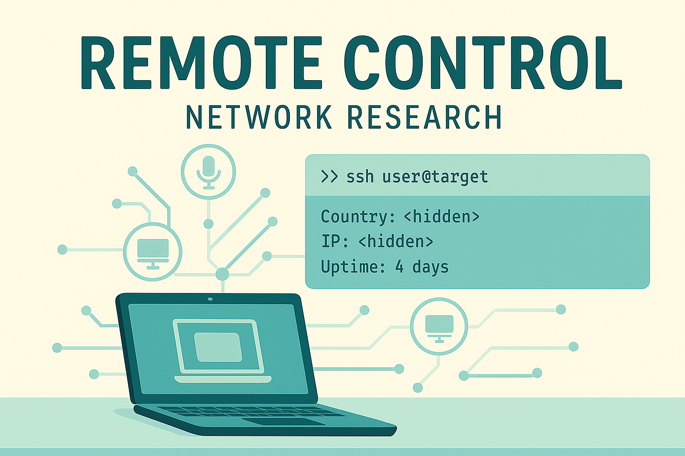

# NETWORK RESEARCH | PROJECT: REMOTE CONTROL

This project was developed as part of the course "Cyber Security" (7736/37) — Information Security and Corporate Network Protection, at John Bryce College.

---

## Table of Contents

- [Project Description](#project-description)
- [Features](#features)
- [Directory Structure](#directory-structure)
- [Installation](#installation)
- [Usage](#usage)
- [Dependencies](#dependencies)
- [Notes](#notes)

---

## Project Description

This Bash script performs remote reconnaissance and system data collection over SSH while anonymizing network traffic through the TOR network using `nipe`. 

Key capabilities include:

1. Checking and installing required tools.
2. Automatic TOR-based anonymization using Nipe.
3. Verifying SSH accessibility of remote hosts.
4. Scanning open ports and services using Nmap.
5. Connecting via SSH using `sshpass`.
6. Collecting system and network information from the target.
7. Logging all results to a timestamped file.
8. Cleaning up system state on script termination.

---

## Features

- **Automatic Dependency Check**: Installs missing packages like `nmap`, `sshpass`, `jq`, `whois`, and more.
- **TOR Anonymity via Nipe**: Automatically installs and runs `nipe` to anonymize outgoing traffic.
- **SSH Target Scanning**: Performs open port scanning (`nmap -sV`) and attempts to connect over SSH.
- **Data Collection via SSH**:
  - `uptime`, `whoami`, `ls -l`, `pwd`
  - Contents of `/etc/passwd`
  - IP information from external APIs
  - WHOIS information of the current IP
- **Netcat Listener**: Receives and logs remote command output securely.
- **Graceful Exit**: On script termination, restores iptables and stops `nipe`.

---

## Directory Structure

```bash
remote_control_results/
└── <timestamp>/
    └── log_<timestamp>.txt
```

- `remote_control_results/` — main folder to store results of each script run
- `<timestamp>/` — subfolder with current run's timestamp
- `log_<timestamp>.txt` — combined log from Nmap, SSH, and remote commands

---

## Installation

Clone the repository:

```bash
git clone https://github.com/Alex-Shev75/NetworkResearch.git
```

Make the script executable:

```bash
cd NetworkResearch
chmod +x TMagen773637.s21.NX201.sh
```

---

## Usage

Run the script as root:

```bash
./TMagen773637.s21.NX201.sh
```

Follow the prompts to enter target IP, SSH username, and password.

---

## Dependencies

The script checks and installs the following tools:

- `nmap`
- `ssh`
- `sshpass`
- `curl`
- `jq`
- `perl`
- `tor`
- `whois`
- `git`
- `netcat`

The `nipe` tool is automatically cloned and configured under `/opt/nipe`.

---

## Notes

- The script **must be run with root privileges**.
- The target host must have **SSH port (22) open and accessible**.
- **Metasploitable2 was used as a testbed** for development and debugging.
- **The Image** in the header of this document was generated using ChatGPT.
- Be realistic: if you think this code will help you hack anyone, prepare to be disappointed. It's just a **school project**. 🙂

